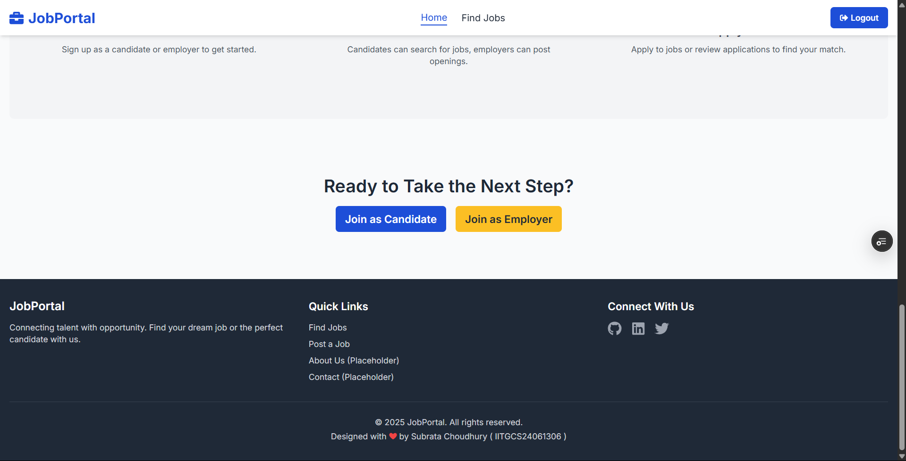

# 🚀 Job Portal - Full Stack Application

A modern, feature-rich job portal built with React, Node.js, Express, and MongoDB. This application provides a comprehensive platform for job seekers and employers with enhanced dashboard functionality and external job integration.


## ✨ Features

### 🎯 Core Functionality
- **User Authentication & Authorization** - JWT-based secure authentication
- **Role-based Access Control** - Separate interfaces for candidates and employers
- **Job Management** - Full CRUD operations for job postings
- **Application System** - Complete job application workflow
- **Profile Management** - Comprehensive user profiles with skills and experience
- **Search & Filtering** - Advanced job search with multiple filters

### 📊 Enhanced Dashboard Experience
- **Candidate Dashboard**
  - Application tracking with status indicators
  - Profile completion percentage
  - Response rate analytics
  - Recent job recommendations
  - Interactive statistics cards

- **Employer Dashboard**
  - Job posting analytics
  - Application management
  - Performance metrics
  - Recent applications tracking
  - Quick action shortcuts

### 🌐 External Job Integration
- **Real-time Job Data** - Integration with external job APIs (JSearch, Adzuna)
- **Cached Results** - Optimized performance with intelligent caching
- **Multi-provider Search** - Aggregate results from multiple job boards
- **External Job Sync** - Automated synchronization of external job listings

### 🎨 Modern UI/UX
- **Responsive Design** - Mobile-first approach with Tailwind CSS
- **Interactive Components** - Smooth animations and hover effects
- **Loading States** - Skeleton UI for better user experience
- **Error Boundaries** - Graceful error handling and recovery

## Directory Structure

```
job-portal/
├── backend/
│   ├── config/
│   │   ├── db.js
│   │   └── index.js
│   ├── controllers/
│   │   ├── analyticsController.js
│   │   ├── applicationController.js
│   │   ├── assignmentController.js
│   │   ├── assignmentSubmissionController.js
│   │   ├── authController.js
│   │   ├── jobController.js
│   │   └── profileController.js
│   ├── middleware/
│   │   ├── authMiddleware.js
│   │   └── errorMiddleware.js
│   ├── models/
│   │   ├── Application.js
│   │   ├── Assignment.js
│   │   ├── AssignmentSubmission.js
│   │   ├── Job.js
│   │   ├── Profile.js
│   │   └── User.js
│   ├── routes/
│   │   ├── analyticsRoutes.js
│   │   ├── applicationRoutes.js
│   │   ├── assignmentRoutes.js
│   │   ├── assignmentSubmissionRoutes.js
│   │   ├── authRoutes.js
│   │   ├── jobRoutes.js
│   │   └── profileRoutes.js
│   ├── utils/
│   │   └── (utility functions, e.g., validators, file upload helpers)
│   ├── .env.example
│   ├── package.json
│   ├── server.js
├── frontend/
│   ├── public/
│   ├── src/
│   │   ├── assets/
│   │   ├── components/
│   │   │   ├── applications/
│   │   │   ├── assignments/
│   │   │   ├── auth/
│   │   │   ├── common/
│   │   │   ├── jobs/
│   │   │   ├── profiles/
│   │   │   └── analytics/
│   │   ├── contexts/
│   │   ├── hooks/
│   │   ├── pages/
│   │   ├── services/
│   │   ├── utils/
│   │   ├── App.jsx
│   │   ├── main.jsx
│   │   └── index.css
│   ├── package.json
│   ├── tailwind.config.js
│   ├── vite.config.js
│   └── README.md
├── .gitignore
├── README.md
├── LICENSE
└── docs/
    ├
    ├
    └── (other documentation files)
```

## System Purpose and Architecture

The Job Portal System addresses the challenges of managing diverse, 
semi-structured data in modern recruitment platforms. 
Built on a three-tier architecture, it leverages MongoDB's document-oriented
approach to handle variable resume formats, dynamic job requirements,
and flexible application workflows that traditional relational databases struggle to 
accommodate efficiently.


[](https://deepwiki.com/p4r1ch4y/job_portal)


## 📸 Screenshots

Here are some screenshots of the Job Portal application in action:

### Homepage (Before Login)


### Homepage (After Login)


### Account Creation Page


### Job Page (Dummy Data)


### External Job Page


### Using Search Function


### Homepage Bottom Section



## 🛠️ Tech Stack

### Frontend
- **React 19.1.0** - Modern React with hooks and context
- **React Router 7.6.1** - Client-side routing
- **Tailwind CSS 3.4.17** - Utility-first CSS framework
- **Axios 1.9.0** - HTTP client for API calls
- **React Icons** - Comprehensive icon library
- **Vite 6.3.5** - Fast build tool and dev server

### Backend
- **Node.js** - JavaScript runtime
- **Express.js 4.21.2** - Web application framework
- **MongoDB** - NoSQL database
- **Mongoose 7.8.7** - MongoDB object modeling
- **JWT** - JSON Web Tokens for authentication
- **bcryptjs** - Password hashing
- **CORS** - Cross-origin resource sharing

### Development Tools
- **ESLint** - Code linting and formatting
- **Vitest** - Unit testing framework
- **Nodemon** - Development server auto-restart

## 🚀 Quick Start

### Prerequisites
- Node.js (v16 or higher)
- MongoDB (v4.4 or higher)
- npm or yarn package manager

### Installation

1. **Clone the repository**
```bash
git clone https://github.com/p4r1ch4y/job-portal.git
cd job-portal
```

2. **Install backend dependencies**
```bash
cd backend
npm install
```

3. **Install frontend dependencies**
```bash
cd ../frontend
npm install
```

4. **Environment Configuration**

Create `.env` files in both backend and frontend directories:

**Backend (.env):**
```env
PORT=5000
JWT_SECRET=your_jwt_secret_here
MONGO_URI=mongodb://localhost:27017/job_portal
NODE_ENV=development

# External Job APIs (Optional)
RAPIDAPI_KEY=your_rapidapi_key_here
ADZUNA_APP_ID=your_adzuna_app_id_here
ADZUNA_APP_KEY=your_adzuna_app_key_here
```

**Frontend (.env.local):**
```env
VITE_API_URL=http://localhost:5000/api
```

5. **Start MongoDB**
```bash
# Using MongoDB service
mongod

# Or using MongoDB Compass/Atlas
```

6. **Run the application**

Backend:
```bash
cd backend
npm run dev
```

Frontend (in a new terminal):
```bash
cd frontend
npm run dev
```

7. **Access the application**
- Frontend: http://localhost:3001
- Backend API: http://localhost:5000

### Test Credentials

For testing purposes, use these pre-created accounts:

**Candidates:**
- john@candidate.com / password123
- jane@candidate.com / password123

**Employers:**
- hr@techcorp.com / password123
- jobs@startupxyz.com / password123

## 🔧 Configuration

### External Job APIs

To enable external job integration, sign up for API keys:

1. **JSearch API (RapidAPI)**
   - Visit: https://rapidapi.com/letscrape-6bRBa3QguO5/api/jsearch
   - Subscribe to get your API key
   - Add to backend `.env` as `RAPIDAPI_KEY`

2. **Adzuna API (Optional)**
   - Visit: https://developer.adzuna.com/
   - Register for free API access
   - Add credentials to backend `.env`

## 🧪 Testing

### Unit Tests
```bash
# Frontend tests
cd frontend
npm run test

# Backend tests (when implemented)
cd backend
npm test
```

### End-to-End Tests
```bash
# Using Cypress (when configured)
npm run test:e2e
```

## 🚀 Deployment

### Vercel (Frontend)

1. **Prepare for deployment**
```bash
cd frontend
npm run build
```

2. **Deploy to Vercel**
```bash
npx vercel --prod
```

3. **Environment Variables**
Set in Vercel dashboard:
- `VITE_API_URL=https://your-backend-url.com/api`

### Backend Deployment Options

1. **Heroku**
2. **Railway**
3. **DigitalOcean App Platform**
4. **AWS/GCP/Azure**
5. **Render**

## Live Demo? 

** Soon ** 👍 **Working on it** ☝️🤓

## 🤝 Contributing

We welcome contributions! Please see [CONTRIBUTING.md](CONTRIBUTING.md) for guidelines.

## 📄 License

This project is licensed under the MIT License - see the [LICENSE](LICENSE) file for details.

---

**Made with ❤️ by the Job Portal Team**
